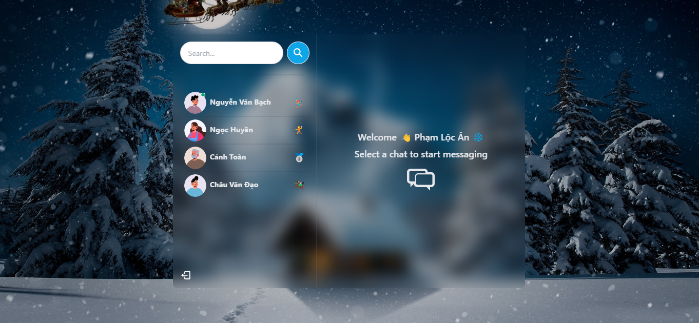
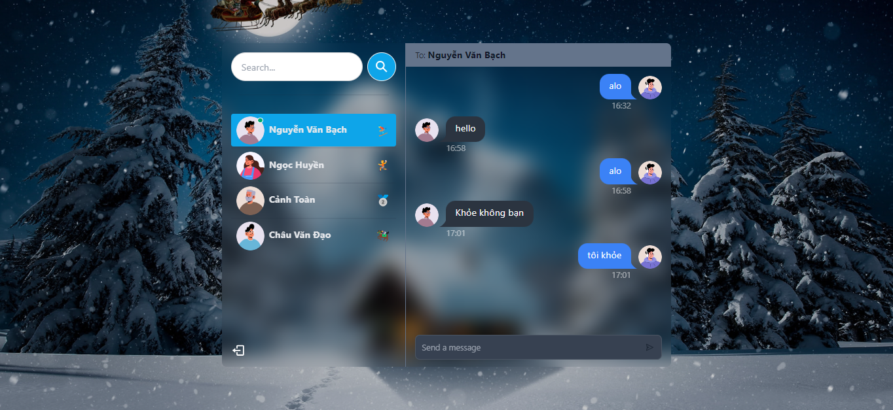

# MERN Project:Real Time Chat App

###

### Video Demo: [Link youtube](https://www.youtube.com/watch?v=T9k1zF1Oz1E)

### Some Features:

- Technology: MERN, TailwindCSS, Socket.io
- Error handling both on the server and on the client
- Authentication && Authorization with JWT
- Online user status (Socket.io and React Context)
- Real-time messaging with Socket.io
